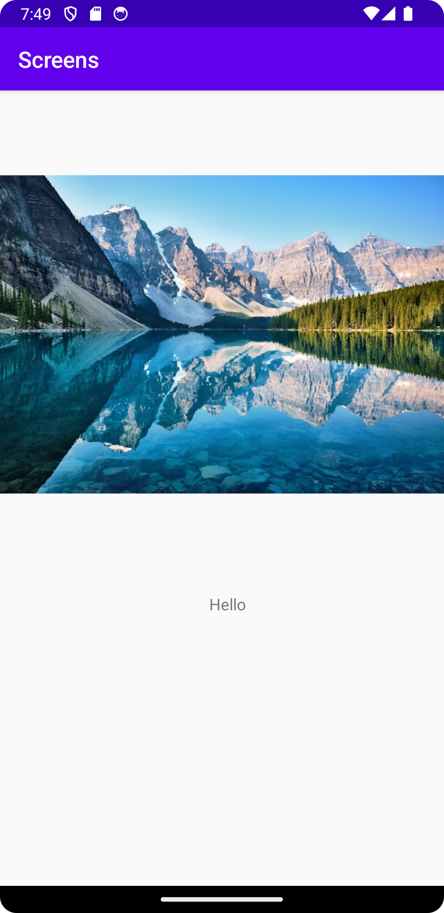

# Rapport
La till en andra aktivitet med namn "TextViewActivity" i java mappen, sedan la jag till en knapp i activity_main.xml
som härleder en, till den andra aktiviteten "TextViewActivity" samtidigt som den skickar med data "Hello"
som byter text på textView till den medskickade datan.

Kod för vid knapp tryck härleder en till andra aktiviteten med medskickad data.
```
 @Override
 public void onClick(View view) {
     Intent intent = new Intent(MainActivity.this, TextViewActivity.class);
     intent.putExtra("greeting", "Hello"); 
     startActivity(intent);
     Log.d("Tag", "New Activity");
 }
```


